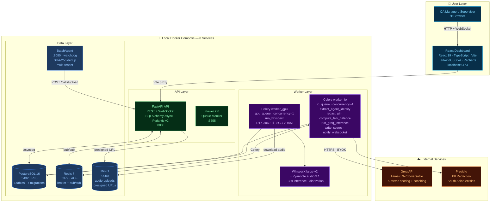
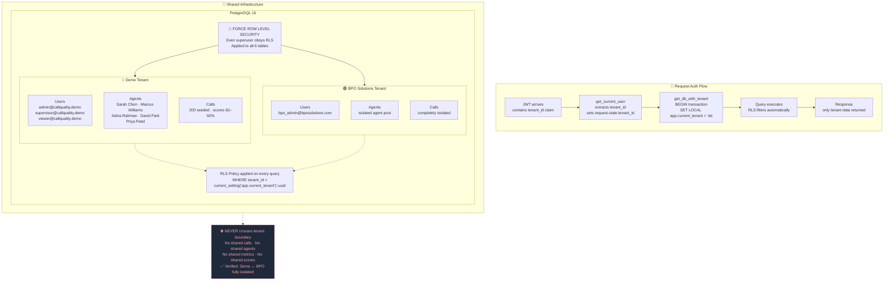

## Diagram 1 — 7-Stage AI Pipeline

```mermaid
flowchart TD
    A([🎙️ Audio Upload\nWAV · MP3 · M4A · max 100MB]):::upload

    subgraph API["⚡ API Layer — Synchronous"]
        B[Stage 1: Ingest\nStore audio → MinIO\nCreate pending DB row]:::api
    end

    subgraph GPU["🖥️ GPU Worker — gpu_queue · concurrency=1 · prefetch=1"]
        C[Stage 2: WhisperX large-v2\nTranscribe + Diarize\nRTX 3060 Ti · ~33s · AGENT/CUSTOMER labels]:::gpu
    end

    subgraph IO["⚙️ IO Worker — io_queue · concurrency=4"]
        D[Stage 3: Extract Agent Identity\nGroq LLM · fuzzy name match\nagainst agents table]:::io
        E{Stage 4: PII Redaction Gate\nPresidio · South Asian entities\nRaw text NEVER hits DB}:::gate
        F[Stage 5: Compute Talk Balance\n1 - 2 × abs agent_ratio - 0.5\nPerfect 50/50 = 1.0]:::io
        G[Stage 6: Groq LLM Scoring\nllama-3.3-70b-versatile\n5 metrics + coaching summary]:::io
        H[Stage 7: Write Scores\nAtomic transaction\ndelete-then-insert · idempotent]:::io
        I[Stage 8: Notify WebSocket\nRedis pub/sub\ncall_complete → browser toast]:::io
    end

    SCORE["Score Formula\n━━━━━━━━━━━━\n0.25 × politeness\n0.20 × sentiment_delta\n0.20 × resolution\n0.15 × talk_balance\n0.20 × clarity\n━━━━━━━━━━━━\n× 10 = 0–100%"]:::formula
    GATE_WARN["🔴 Security Gate\nIf pii_redacted ≠ TRUE\n→ inference refused"]:::warn

    A --> B
    B --> C
    C -->|segments[]| D
    D -->|redacted_segments[]| E
    E -->|pii_redacted = TRUE| F
    E -.->|BLOCKED| GATE_WARN
    F --> G
    G --> H
    H --> I
    H -.-> SCORE

    classDef upload fill:#3b82f6,stroke:#1d4ed8,color:#fff,rx:12
    classDef api fill:#0ea5e9,stroke:#0369a1,color:#fff
    classDef gpu fill:#7c3aed,stroke:#4c1d95,color:#fff
    classDef io fill:#0f766e,stroke:#134e4a,color:#fff
    classDef gate fill:#dc2626,stroke:#7f1d1d,color:#fff
    classDef formula fill:#1e293b,stroke:#f59e0b,color:#f59e0b,stroke-dasharray:5 5
    classDef warn fill:#1e293b,stroke:#dc2626,color:#dc2626,stroke-dasharray:5 5
```

---

## Diagram 2 — System Architecture



---

## Diagram 3 — Multi-Tenancy & RLS


