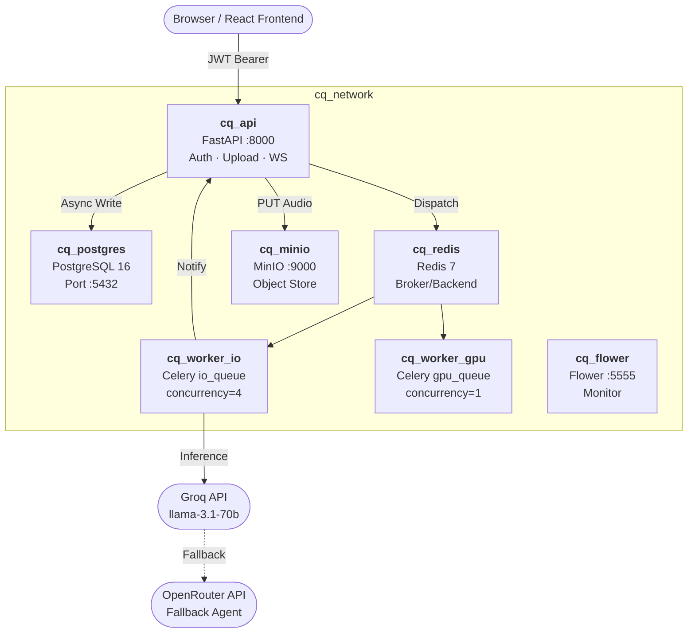
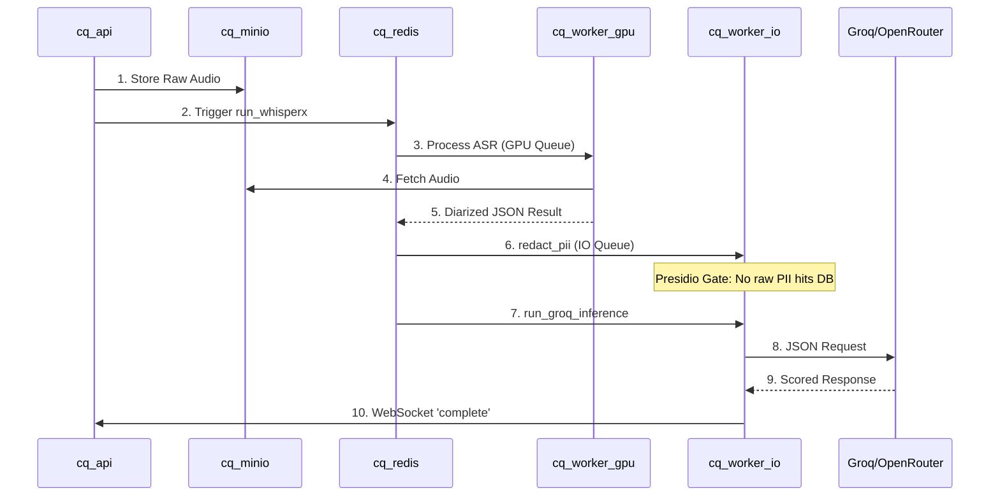
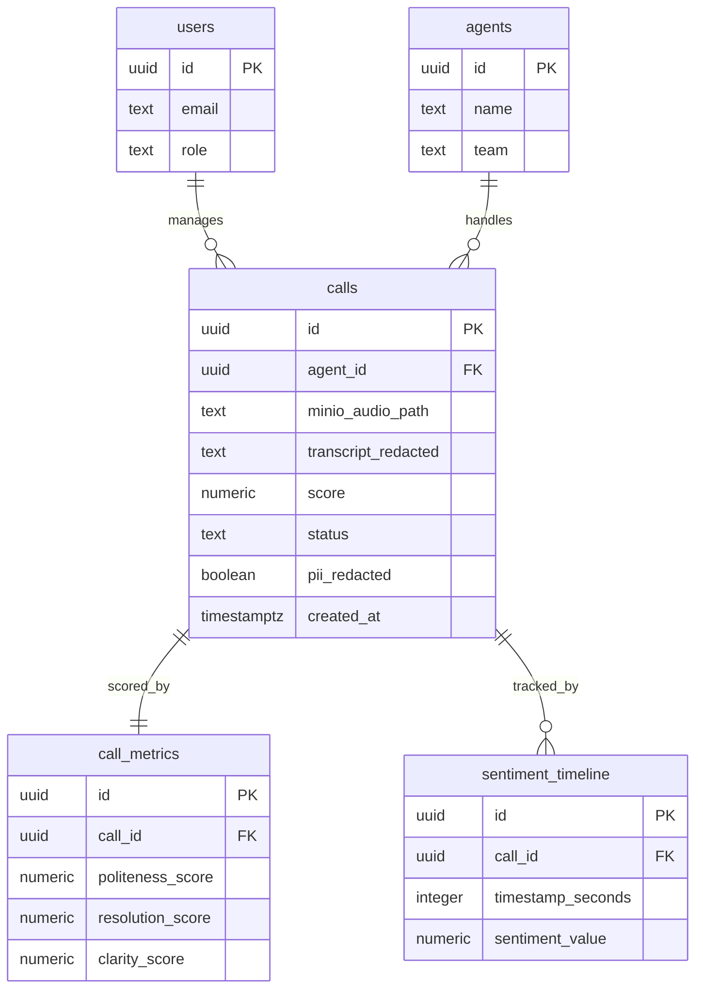

# AI Call Quality & Agent Performance Analytics System
## Project Master Roadmap & Architectural Specification

**Status:** Phase 1 Complete ✅ | Phase 2 Commencing 🏗️


## 1. System Overview
This system is a decoupled, containerized AI analytics engine designed to transcribe, redact, and score customer service calls. It utilizes a distributed task queue to separate high-intensity GPU workloads (ASR) from high-concurrency IO workloads (LLM Inference/DB writes).

### Core Architecture
The system operates within a unified Docker network (`cq_network`) with 7 primary services.




## 2. Phase 2: AI Pipeline (The "Brain")

Phase 2 implements a 7-stage sequential pipeline. Every stage is a Celery task. Stage 3 (PII Redaction) serves as a mandatory security gate.

### Pipeline Sequence Diagram



### Pipeline Specification

| Stage | Task | Queue | Input | Output |
| --- | --- | --- | --- | --- |
| **01** | `ingest_upload` | API Sync | Multipart File | MinIO Path |
| **02** | `run_whisperx` | `gpu_queue` | MinIO Path | Diarized JSON |
| **03** | `redact_pii` | `io_queue` | Diarized JSON | Redacted JSON |
| **04** | `compute_talk_balance` | `io_queue` | Segment List | Float (0-1) |
| **05** | `run_groq_inference` | `io_queue` | Redacted Text | JSON Metrics |
| **06** | `write_scores` | `io_queue` | All Data | DB Commit |
| **07** | `notify_websocket` | `io_queue` | call_id | WS Event |


## 3. Database Schema (ERD)

The schema is optimized for analytical queries and historical score tracking.




## 4. Engineering Invariants

To maintain SRC-grade integrity, these rules must never be violated:

1. **PII Security Gate:** Raw transcripts (containing PII) must **never** be written to the database. Only the output of `redact_pii` is persisted.
2. **Audio Isolation:** Audio binary data stays in MinIO. Only the object path is stored in PostgreSQL.
3. **Queue Isolation:** `run_whisperx` is pinned to `gpu_queue` (concurrency=1) to prevent VRAM overflow. All other tasks use `io_queue` (concurrency=4).
4. **Atomic Persistence:** Updates to `calls`, `call_metrics`, and `sentiment_timeline` must be executed within a single ACID transaction.


## 5. Milestone Roadmap

| Day | Phase | Milestone | Status |
| --- | --- | --- | --- |
| **1** | Phase 1 | Infra, Auth, MinIO Upload, Celery Config | ✅ |
| **2** | Phase 2.1 | WhisperX ASR + GPU Queue Routing | 🏗️ |
| **3** | Phase 2.2 | PII Redaction + Groq Inference Scoring | 🔲 |
| **4** | Phase 3 | Read Endpoints + Playwright PDF Export | 🔲 |
| **5** | Phase 4 | React Dashboard + Recharts Visualization | 🔲 |
| **6** | Phase 5 | Azure T4 Deployment + Demo Hardening | 🔲 |


## 6. Budget & Resources

* **Target OS:** Windows (Dev) / Azure Linux (Prod)
* **GPU:** NVIDIA T4 (Azure NC4as_T4_v3)
* **LLM Tier:** Groq (Llama-3.1-70b)
* **Azure Credit:** $85.00
* **Estimated Spend:** ~$11.50

```
